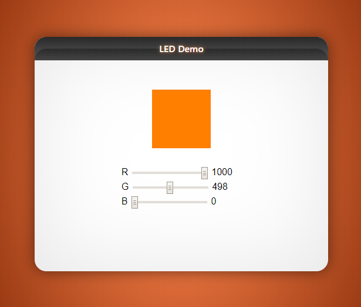

# RGB LED Site Demo

    

**Description:** This example demonstrates the ESP32 as a static file server as well as using AJAX requests to update the duty cycle of an onboard RGB LED. Note this is designed to work with the **[wrover-kit](https://docs.espressif.com/projects/esp-idf/en/latest/get-started/get-started-wrover-kit.html)** hardware.

## Usage

* Configure the project using `make menuconfig` and goto `Example Configuration` ->
    1. WIFI SSID: WIFI network to which your PC is also connected to.
    2. WIFI Password: WIFI password

* In order to test the file server demo :
    1. compile and burn the firmware `make flash`
    2. run `make monitor` and note down the IP assigned to your ESP module. The default port is 80
    3. test the example interactively on a web browser (assuming IP is 192.168.43.130):
    1. open path `http://192.168.43.130/`

